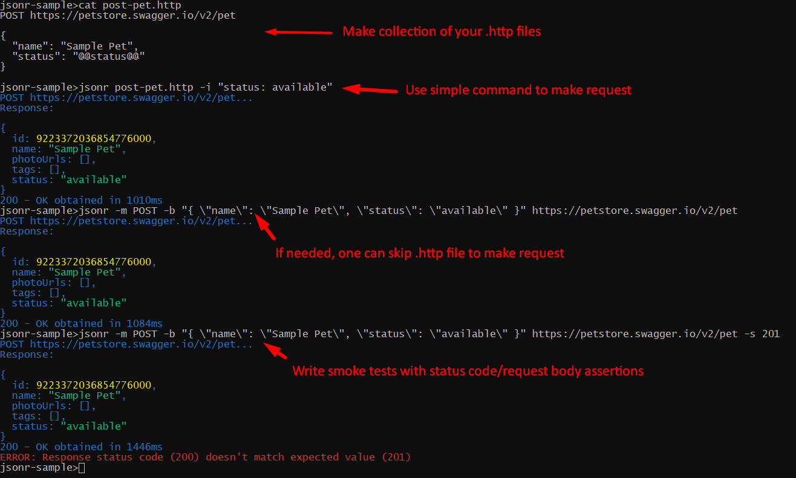

# About

- :pager: Are you tired of your UI http client asking you to sign in/sign up so
  they can create proper `workspace` for you? (and get your email to send you
  marketing emails)
- :hourglass_flowing_sand: Are you waiting for ages until your UI http client
  loads all it's functionalities and plugins that you don't need?
- :file_cabinet: Are you spending lots of time trying to find requests you've
  sent to given api months ago?
- :microscope: Are you searching how to change request method in `curl` because
  you don't use `curl` that often?
- :clipboard: Are you working with modern json http api's?
- :dash: Do you want to write smoke tests for your api?

`jsonr` is a simple CLI tool for interacting with json http api's and writing
simple smoke tests. It's available from your terminal anytime when you need it
(so you don't need to switch context) and it's not aimed to be an ultimate
solution for everything. That's why it's so simple to use. No more need to
browse lots of documentation about tons of features that you don't need. 5
minutes and you are ready to send any requests.



Run `jsonr --help` for details.

## Prerequisites

Deno runtime environment `https://deno.land`

## Installation

### Option 1: Install via Deno (Recommended)

**Prerequisites:**

- Deno runtime environment

**Install Command:**

```bash
deno install -g --allow-write --allow-net --allow-read -f -r -n jsonr jsr:@sobanieca/jsonr
```

To update to the latest version, run the same installation command

`--allow-write` permission is needed only if you are planning to use `-o`
parameter (write response body to file, check `jsonr --help` for details)

### Option 2: Pre-compiled Binaries

Download the latest pre-compiled binary for your operating system from the
[releases page](https://github.com/sobanieca/jsonr/releases/latest):

**Example for Linux x64:**

```bash
curl -L -o jsonr https://github.com/sobanieca/jsonr/releases/latest/download/jsonr-linux-x64
chmod +x jsonr
sudo mv jsonr /usr/local/bin/
```

Available binaries: `jsonr-linux-x64`, `jsonr-linux-arm64`, `jsonr-macos-x64`,
`jsonr-macos-arm64`

### SSL Certificate Issues

If your requests are failing due to certificate validation errors (and you trust
target server) you can run `temporary` command like:

`deno run --allow-net --unsafely-ignore-certificate-errors jsr:@sobanieca/jsonr ...`

It will display warning about disable ssl verification, but you should be able
to perform requests. If you work frequently with such unsafe servers you can
consider introducing `jsonr-unsafe` sitting next to your main `jsonr` instance:

`deno install -n jsonr-unsafe -g -f -r --unsafely-ignore-certificate-errors --allow-net --allow-read --allow-write jsr:@sobanieca/jsonr`

## Usage

Sample usage:

`jsonr -h "Authorization: Bearer MyToken" my-request.http`

`my-request.http` file content:

```
POST http://my-api.com/endpoint

{
  "someKey": "someValue"
}
```

Type `jsonr --help` for more details on usage once you have a tool installed.

### Working with Large Responses

When dealing with large response bodies, you can pipe the output to `grep` to
filter specific content:

```bash
# Search for a specific property in a large JSON response
jsonr my-api-request.http | grep "someProperty" -C 10

# Extract specific fields from JSON responses
jsonr my-api-request.http | grep -E '"(id|name|email)"' -C 2
```

## Hints

- If you want to disable colors (at least for main log messages), you can use:

```
NO_COLOR=1 jsonr ...
```

- It is recommended to wrap URLs with quotes to avoid shell conflicts:

```bash
jsonr "https://api.example.com/users?filter=active&sort=name"
```

## Contribution

If you want to implement/request new features you are more than welcome to
contribute. Please keep in mind that this tool is supposed to be super simple to
use and cover ~80% of use cases for playing around with JSON HTTP API's.
Instructions (--help) for this tool should be possible to read in less than 5
minutes. If more features will be added this may be hard to achieve.
