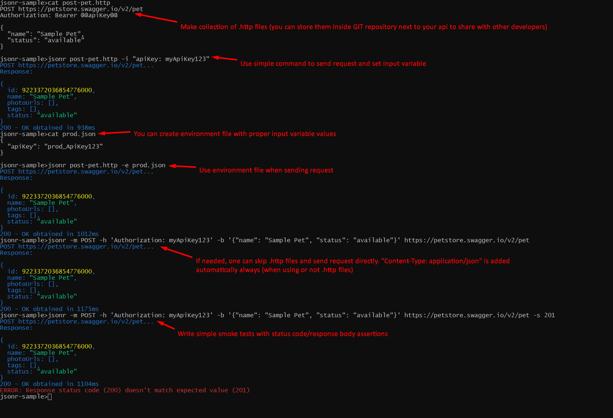

# About

- :pager: Are you tired of your UI http client asking you to sign in/sign up so
  they can create proper `workspace` for you? (and get your email to send you
  marketing emails)
- :hourglass_flowing_sand: Are you waiting for ages until your UI http client
  loads all it's functionalities and plugins that you don't need?
- :file_cabinet: Are you spending lots of time trying to find requests you've
  sent to given api months ago?
- :microscope: Are you searching how to change request method in `curl` because
  you don't use `curl` that often?
- :clipboard: Are you working with modern json http api's?
- :dash: Do you want to write smoke tests for your api?
- :link: Need a scripting tool to chain requests?

`jsonr` is a simple CLI tool for interacting with json http api's and writing
simple smoke tests. It's available from your terminal anytime when you need it
(so you don't need to switch context) and it's not aimed to be an ultimate
solution for everything. That's why it's so simple to use. No more need to
browse lots of documentation about tons of features that you don't need. 5
minutes and you are ready to send any requests.



Run `jsonr --help` for details.

## Prerequisites

Deno runtime environment `https://deno.com` (required for recommended
installation method)

## Installation

### Option 1: Install via Deno (Recommended)

```bash
deno install -g --allow-write --allow-net --allow-read -f -r -n jsonr jsr:@sobanieca/jsonr
```

`--allow-write` permission is needed only if you are planning to use `-o`
parameter (write response body to file, check `jsonr --help` for details)

### Option 2: Quick Install Script (Standalone Binary)

If you don't have Deno installed, you can install the pre-compiled binary with a
single command:

```bash
curl -fsSL sobanieca.github.io/jsonr/install.sh | bash
```

This script automatically detects your OS and architecture (Linux/macOS,
x64/arm64) and installs the appropriate binary to `/usr/local/bin`.

To install to a custom location:

```bash
curl -fsSL sobanieca.github.io/jsonr/install.sh | INSTALL_DIR=~/bin bash
```

### Option 3: Manual Binary Installation

Download the latest pre-compiled binary for your operating system from the
[releases page](https://github.com/sobanieca/jsonr/releases/latest):

**Example for Linux x64:**

```bash
curl -L -o jsonr https://github.com/sobanieca/jsonr/releases/latest/download/jsonr-linux-x64
chmod +x jsonr
sudo mv jsonr /usr/local/bin/
```

Available binaries: `jsonr-linux-x64`, `jsonr-linux-arm64`, `jsonr-macos-x64`,
`jsonr-macos-arm64`

## Updating

### For Deno Installations

To update `jsonr` to the latest version, use the `update` command:

```bash
jsonr update --deno
```

This will ask for run permission and automatically update jsonr to the latest
version from JSR.

### For Pre-compiled Binaries

Run the `install.sh` script to update to the latest version, or download the
latest binary from the
[releases page](https://github.com/sobanieca/jsonr/releases/latest).

## SSL Certificate Issues

If your requests are failing due to certificate validation errors (and you trust
target server) you can run `temporary` command like:

`deno run --allow-net --unsafely-ignore-certificate-errors jsr:@sobanieca/jsonr ...`

It will display warning about disable ssl verification, but you should be able
to perform requests. If you work frequently with such unsafe servers you can
consider introducing `jsonr-unsafe` sitting next to your main `jsonr` instance:

`deno install -n jsonr-unsafe -g -f -r --unsafely-ignore-certificate-errors --allow-net --allow-read --allow-write jsr:@sobanieca/jsonr`

## Usage

Sample usage:

`jsonr -h "Authorization: Bearer MyToken" my-request.http`

`my-request.http` file content:

```
POST http://my-api.com/endpoint

{
  "someKey": "someValue"
}
```

Type `jsonr --help` for more details on usage once you have a tool installed.

### Configuration Files

jsonr supports configuration files named `jsonr-config.json` that can store
default values for command-line parameters. This feature eliminates the need to
repeat common parameters (like environment files) in every command.

#### How it works

jsonr automatically searches for `jsonr-config.json` files starting from your
current directory and moving up to your home directory. Configuration files
closer to your current directory take precedence over those in parent
directories, and command-line parameters always override configuration defaults.

#### Example Configuration

Generate a sample configuration file with all available options:

```bash
jsonr config
```

Or create a `jsonr-config.json` file manually in your project directory:

```json
{
  "defaults": {
    "environment": "~/.secret/sandbox-env.json"
  }
}
```

With this configuration, you can run:

```bash
jsonr ./my-request.http
```

Instead of having to type:

```bash
jsonr -e ~/.secret/sandbox-env.json ./my-request.http
```

The environment file will be automatically loaded from the config. You can still
override it by explicitly providing the `-e` flag:

```bash
jsonr -e ./production-env.json ./my-request.http
```

#### Supported Configuration Keys

Use camelCase for property names (matching the SDK options):

- `environment` - Default environment file path (supports `~` for home
  directory)
- `headers` - Default headers to include in all requests
- `input` - Default input variables for @@variable@@ replacement
- `status` - Expected response status code for validation
- `text` - Expected text in response body
- `method` - Default HTTP method
- `body` - Default request body
- `verbose` - Enable verbose mode (true/false)
- `raw` - Enable raw mode (true/false)
- `followRedirects` - Automatically follow HTTP redirects (true/false)
- `output` - Default output file path
- `omitDefaultContentTypeHeader` - Omit default Content-Type header (true/false)
- `js` - Treat body as JavaScript object literal (true/false)

Run `jsonr config` to generate a complete sample configuration file with
detailed comments for each option.

#### Configuration Hierarchy

You can place `jsonr-config.json` files at different levels to create a
configuration hierarchy:

- `~/jsonr-config.json` - Global defaults for all projects
- `~/projects/jsonr-config.json` - Defaults for all projects in this directory
- `~/projects/my-app/jsonr-config.json` - Defaults specific to my-app

When you run jsonr from `~/projects/my-app/`, it will merge all three
configurations, with more specific configurations (closer to your working
directory) taking precedence.

### Programmatic Usage - chaining requests

You can use `jsonr` programmatically in your Javascript scripts to chain
multiple requests and handle responses in code.

To get started, generate a template script:

```bash
jsonr init
jsonr init ./requests/get.http
jsonr init https://api.example.com/endpoint
```

This creates a `jsonr-script.js` file that you can customize. Here's an example
that creates a user and then posts an order using the returned user ID:

```javascript
// Create a new user
const userResponse = await jsonr("https://api.example.com/users", {
  method: "POST",
  body: {
    name: "John Doe",
    email: "john@example.com",
  },
  status: 201,
});

const userId = userResponse.body.id;
console.log(`Created user with ID: ${userId}`);

// Create an order for the newly created user
const orderResponse = await jsonr("https://api.example.com/orders", {
  method: "POST",
  body: {
    userId: userId,
    items: ["product-123", "product-456"],
    total: 99.99,
  },
  status: 201,
});

console.log(`Order created with ID: ${orderResponse.body.id}`);
```

Run your script with:

```bash
jsonr run jsonr-script.js
```

The `jsonr` function is automatically available in scripts run with
`jsonr run` - no import needed!

### Working with Large Responses

When dealing with large response bodies, you can pipe the output to `grep` to
filter specific content:

```bash
# Search for a specific property in a large JSON response
jsonr my-api-request.http | grep "someProperty" -C 10

# Extract specific fields from JSON responses
jsonr my-api-request.http | grep -E '"(id|name|email)"' -C 2
```

## Hints

- If you want to disable colors (at least for main log messages), you can use:

```
NO_COLOR=1 jsonr ...
```

- It is recommended to wrap URLs with quotes to avoid shell conflicts:

```bash
jsonr "https://api.example.com/users?filter=active&sort=name"
```

## Contribution

If you want to implement/request new features you are more than welcome to
contribute. Please keep in mind that this tool is supposed to be super simple to
use and cover ~80% of use cases for playing around with JSON HTTP API's.
Instructions (--help) for this tool should be possible to read in less than 5
minutes. If more features will be added this may be hard to achieve.
